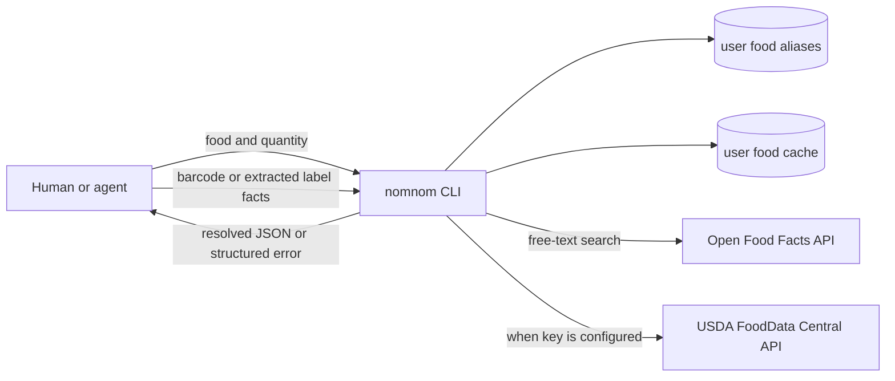

# nomnomcli

[](LICENSE)
[](https://github.com/maxjustships/nomnomcli/actions/workflows/ci.yml)

**nomnom stores nothing about food; it computes what you feed it.**

`nomnomcli` is an agent-first nutrition ledger. Version 0.4 ships zero food records: no food
database, synonym corpus, or piece-weight table is hidden in the package. It resolves food at
runtime, performs nutrition arithmetic in code, and stores successful logs plus a user-owned cache
in SQLite. There is no LLM in the program and no invented nutrition fallback.



## Install

```sh
curl -fsSL https://raw.githubusercontent.com/maxjustships/nomnomcli/main/install.sh | sh
```

This creates or updates a user-level `nomnom` command in `$HOME/.local/bin`. The installer tries
`uv tool install` first, then pipx, then a non-virtualenv Python 3.11+ user-site install. Every
installer selection, invocation, and executable lookup runs in a target-user sanitized environment:
inherited agent `UV_TOOL_*`, `PIPX_*`, and XDG tool-location overrides are ignored, and uv/pipx are
explicitly directed to target-home defaults. It verifies the actual executable, `nomnom --version`,
and `nomnom doctor --json` in that sanitized user/system-only environment. Bootstrap verification
uses `$HOME/.config`; every `NOMNOM_*` override is ignored. It never opens the meal database, cache,
or aliases.

For machine-readable agent output:

```sh
curl -fsSL https://raw.githubusercontent.com/maxjustships/nomnomcli/main/install.sh \
  | sh -s -- --status-json
```

The structured `status` is `installed_base_ready`, `installed_and_ready`,
`installed_path_repair_needed`, or `error`. A healthy no-token install is
`installed_base_ready`; `installed_and_ready` is reserved for configured, reachable USDA enhanced
coverage. JSON also reports `generic_coverage` as `base` or `enhanced` and an
`optional_usda_setup` action when relevant. PATH repair remains the top-level status while retaining
those capability fields. No credential value is emitted. `--dry-run` remains available.

Check the optional generic-food connection without a prompt:

```sh
nomnom setup --status --json
```

Without a key it reports `status: base_ready` and `generic_coverage: base`; base cache, aliases,
OFF barcode/full-text, and source-backed label capture are ready. USDA provides optional broader no-photo generic/raw-food coverage. A configured and reachable key reports `status: connected` and
`generic_coverage: enhanced`. Run `nomnom setup` only when that broader coverage is wanted or a
specific food cannot be safely resolved. Setup validates the key before saving and never opens a
browser by itself.

USDA credentials are local user configuration, never repository or database content. The default
path is `$XDG_CONFIG_HOME/nomnomcli/config.toml` or `~/.config/nomnomcli/config.toml`, written with
owner-only `0600` permissions. `NOMNOM_USDA_KEY` is the non-interactive/CI option and takes
precedence over the stored key. Avoid putting it in commands, logs, or checked-in environment
files.

## Resolve and log food

```sh
nomnom log --parse "rice 150 g, eggs 2 pieces" --json
nomnom log --food "chickpeas, cooked" --grams 120 --json
```

Resolution is deterministic and ordered:

1. exact phrase in the user's alias table, pointing to an exact local cache name;
2. exact match in the user's `food_cache`;
3. token-overlap search in that cache;
4. strict Open Food Facts free-text search;
5. a safe USDA FoodData Central generic proxy, when a setup key or
   `NOMNOM_USDA_KEY` is configured;
6. actionable JSON error—never a guessed food.

Open Food Facts candidates need complete normalized query-token coverage from the returned product
name/brand, a matching food type/category, a source identity/barcode, and complete positive finite
kcal, protein, fat, and carbs. A branded source identity is cached as `exact_product`; an unbranded
source identity is truthfully cached as `generic_proxy` and remains subject to the configured proxy
policy. Rejected results are neither cached nor logged.

Successful API results are cached in the user's database, so the same food can resolve locally
later. Existing cache records, logs, recipes, and aliases are preserved when v0.4 opens the
database.
`nomnom search QUERY` searches this user cache; it is not a packaged food catalog.

Open Food Facts free-text search goes directly through the official legacy v1 endpoint,
`https://world.openfoodfacts.org/cgi/search.pl`, with `search_terms`, `search_simple=1`,
`action=process`, `json=1`, `page_size`, the supported response `fields`, and a descriptive
nomnomcli User-Agent. API v2 search is structured/filter-only: nomnom never sends free-text
`search_terms` to v2 and never falls back to unfiltered v2 catalog rows. Direct `requests` calls are
intentional because this small provider contract remains explicit and replay-testable.

Both OFF capabilities use bounded backoff for HTTP 429 and 5xx responses and safely honor a
numeric, bounded `Retry-After`. If v1 remains unavailable after retries, the OFF client raises the
typed retryable error `openfoodfacts_unavailable`; the no-key resolver preserves it inside
`food_needs_source.provider_error`. It never silently changes endpoint or returns unrelated
products. Product normalization and the token/category confidence checks still apply to every v1
candidate.

### Optional USDA enhancement

Check first, then run the one-time guided connection only if needed:

```sh
nomnom setup --status --json
nomnom setup
nomnom doctor --json
```

Get a free key at the official signup page
<https://fdc.nal.usda.gov/api-key-signup.html>. For non-interactive/CI use only, set it in the
environment:

```sh
export NOMNOM_USDA_KEY="your-key"
```

Without a key, a food that OFF cannot safely resolve returns `food_needs_source`, not a provider-key
failure. Its first-screen actions offer a package photo, barcode, source-backed `capture label`, and
the user's local cache/aliases. USDA appears separately as an optional enhancement for broader
no-photo generic/raw-food coverage. The nested `provider_error` preserves OFF candidate,
alternatives, retryability, and other technical diagnostics. Nothing unsafe is cached or logged.

When enabled, USDA search requires complete positive kcal/protein/fat/carbs, scores query token
overlap together with data type and category, prefers Foundation and SR Legacy, and enforces a
confidence floor. Weak matches return `usda_low_confidence` with candidate alternatives and are
never cached.

The default generic policy is `allow_for_unbranded`. A USDA result becomes a generic proxy only
when it is an unbranded Foundation, SR Legacy, or Survey (FNDDS) record with an FDC id and every
normalized query token is covered by its name. Brand/SKU-like or unmatched input and branded USDA
records return `exact_resolution_required` without cache or log writes. Accepted proxies expose
`resolution_mode=generic_proxy`, `source=usda`, the FDC `source_id`, `provenance=usda`, confidence,
and an explicit assumption in log JSON.

Choose a stricter policy in the user config:

```toml
[resolution]
generic_proxy_policy = "ask" # or "exact_only"
```

`NOMNOM_GENERIC_PROXY_POLICY` overrides the file. `ask` returns
`generic_proxy_confirmation_required` with the candidate but writes nothing; `exact_only` requires
barcode or package-label capture. Supported values are `allow_for_unbranded`, `ask`, and
`exact_only`.

Set `NOMNOM_OFFLINE=1` to prevent all remote food lookup. Set `NOMNOM_DISABLE_OFF=1` to skip OFF
while retaining USDA when its key is configured.

## Capture an exact packaged product

When an exact packaged product is needed, use its barcode or ask the user for a package photo. A
barcode capture calls only the Open Food Facts v2 product endpoint; it never sends free text:

```sh
nomnom capture barcode "0123456789012" --json
```

If the barcode is absent or OFF lacks complete core nutrition, the agent reads the supplied label
photo and passes the extracted per-100 g facts to the CLI:

```sh
nomnom capture label \
  --name "chicken pastrami" --brand "Example" \
  --kcal 110 --protein 20 --fat 2 --carbs 3 \
  --serving-grams 75 \
  --source-note "image:sha256:LOCAL_REFERENCE" --json
```

`--source-note` is required. Use a nonempty local or opaque image/barcode reference that lets the
user trace the facts without putting the image itself in SQLite. The CLI has no OCR or vision
dependency, never receives or stores the photo, never estimates missing macros, and rejects
non-finite/negative values or a non-positive serving weight without writing. Both capture paths
persist `resolution_mode=exact_product`, source identity, provenance, and the normalized nutrition
facts; the canonical name can then be used in an alias and logged offline.

### Legacy manual pin

`nomnom add` remains available for existing manual workflows. For a new packaged product, prefer
the source-backed capture commands above. Use only verified per-100 g label values:

```sh
nomnom add \
  --name "whole-grain bread" --brand "Example Bakery" \
  --kcal 250 --protein 9 --fat 4 --carbs 45 \
  --piece-grams 40 --json
```

The optional `--piece-grams` is the only manual piece-weight input. It makes later piece counts
work from the cached record.

### User food aliases

Aliases are explicit user-owned mappings stored only in the same user SQLite database as the food
cache. Their targets must be exact canonical names already present in that cache; creating or using
an alias never performs a remote target lookup. Alias matching is exact after case and whitespace
normalization, so an alias does not match unrelated longer food names.

```sh
nomnom alias add "хлеб harry's" "harry's american sandwich — Harry's" --json
nomnom alias list --json
nomnom alias remove "хлеб harry's" --json
```

Add or resolve the canonical food first. A missing target returns `alias_target_not_found`; adding
an existing phrase returns `alias_exists`; removing a missing phrase returns `alias_not_found`.

## Canonical agent input contract

The canonical shape supplied to nomnom is **food name + quantity + unit + optional modifiers**.
For example: `egg 3 pieces`, `rice 150 g`, or `bread 2 pieces at 40 g`. Quantity and unit are
required; modifiers may express a fraction, size, or explicit per-piece mass.

An agent translates the user's language into this contract before invoking nomnom. Translation may
choose a canonical food name already known to the user cache or an explicit user alias. Nutrition
resolution is a separate deterministic step: alias → local cache → Open Food Facts → USDA → error.
The agent must not translate by inventing nutrition values or silently substituting another food.

## Quantities, sizes, and dishes

The parser accepts kilograms, grams, millilitres, pieces, fractions, and explicit per-piece grams.
English and Russian size words such as `small` and `небольшой` remain valid syntax, but a size word
does not supply a packaged estimate. Piece grams come only from explicit user input or serving data
on the resolved cached/pinned/API food record. Assumptions identify the provider, source field, and
returned value. When serving data is absent, structured `piece_weight_unknown` asks for exact
grams. Explicit grams always win, including `3 pieces FOOD at 38g` → `114g`.

```sh
nomnom log --parse "bread 2 pieces at 40g" --json
nomnom log --parse "яичница из 3 небольших яиц" --json
```

Supported dish prefixes split only the ingredients the user stated. nomnom never silently adds oil
or another ingredient. Millilitres use a resolved density when available and otherwise retain the
documented 1 g/ml conversion.

### Adding a new language

Provide an agent-side translator that emits the canonical contract and, when desired, create
user-specific food-name mappings with `nomnom alias add`. Food translations are user data, not
package data.

Parser syntax aliases for ordinary units, fractions, sizes, per-piece markers, dish prefixes, and
conjunctions are declarative tables in `nomnomcli/parser.py`. Add reviewed forms to those tables and
their tests; parser code changes are not required for ordinary unit aliases. A new language must
still provide quantity/unit forms unambiguously, and its agent translator remains responsible for
food names.

## Errors and output

Add `--json` for stable machine-readable output. User-correctable failures are written to stderr as
an `error` object and exit with status 2. Important codes include:

- `food_needs_source`: use the returned photo, barcode, label-capture, or local-cache path; inspect
  nested `provider_error` for OFF diagnostics. USDA is an explicitly optional enhancement.
- `off_low_confidence`: retained as nested technical detail when OFF candidates fail strict safety
  checks.
- `usda_low_confidence`: inspect the FDC candidate/data type/category and retry more specifically;
  no near match was cached.
- `usda_invalid_nutrition`: every USDA candidate lacked one or more complete positive core values.
- `generic_proxy_confirmation_required`: show the named USDA candidate and ask before changing the
  configured policy; nothing was cached or logged.
- `exact_resolution_required`: request the barcode or a package photo for source-backed capture.
- `invalid_barcode` / `barcode_not_found` / `barcode_nutrition_incomplete`: correct the barcode or
  request a package photo; failed captures write nothing.
- `invalid_source_note` / `invalid_nutrition`: correct the extracted label facts; failed captures
  write nothing.
- `piece_weight_unknown`: ask for grams or add a verified `--piece-grams` value.
- `alias_target_not_found`: add/resolve the exact cached target or remove the stale alias.
- `openfoodfacts_unavailable` / `usda_unavailable`: retry later or use a manual label.

Provider-unavailable errors include a `retryable` boolean. In `nomnom doctor --json`, OFF reports:

- `product_lookup_reachable`: the v2 product-by-barcode endpoint answered after bounded retries;
  this says nothing about free-text search.
- `full_text_search_ready`: the same v1 CGI capability used by runtime free-text resolution
  answered with a valid product-list payload; when false, OFF free-text resolution is unavailable.

`configured` means OFF needs no credential. USDA retains `configured`, `reachable`, and
`key_source`. Doctor never includes credential values.

Successful logs are stored immediately. Agents should show the returned names, grams, confidence,
alternatives, and assumptions before treating the resolution as confirmed.

## Stats and recipes

```sh
nomnom stats today --json
nomnom stats week --json
nomnom recipe add "https://example.com/recipe" --servings 4 --json
nomnom recipe log "Recipe name" --portions 1.5 --json
```

Recipe ingredients use the same runtime resolver. An unresolved ingredient fails the whole import
instead of storing partial nutrition.

User data defaults to `~/.local/share/nomnomcli/nomnom.sqlite3`. Override it with
`NOMNOM_DB_PATH`. Schema v4 upgrades preserve cached foods, logs, recipes, and aliases in place and
add resolution mode, source identity/note, provenance, and assumption fields to the food cache.

## Agent skill and development

The repository agent workflow is [`skill/SKILL.md`](skill/SKILL.md). It teaches agents to use
nomnom's JSON, accept only safe generic proxies, request a barcode/package photo for exact products,
capture extracted label facts with a source note, and never estimate nutrition in their own
context.

```sh
python -m pip install -e '.[dev]'
PYTHONPATH=. pytest -q
ruff check .
```

All API tests use payloads under `tests/fixtures/` and mocked HTTP; the test suite never requires
network access.

## License

GNU Affero General Public License v3.0. See [LICENSE](LICENSE).
