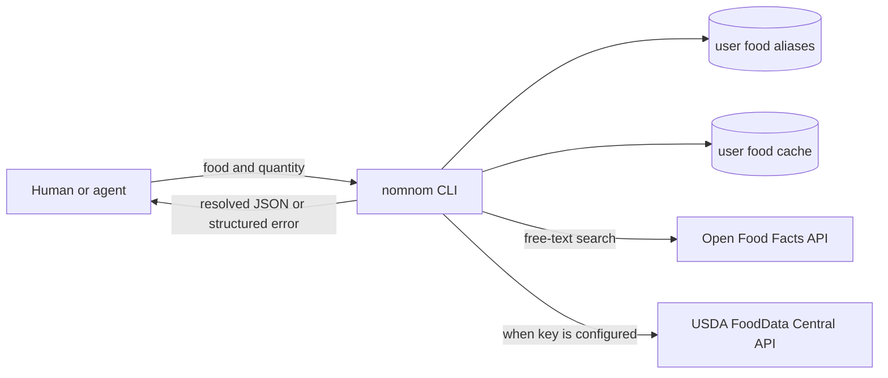

# nomnomcli

[](LICENSE)
[](https://github.com/maxjustships/nomnomcli/actions/workflows/ci.yml)

**nomnom stores nothing about food; it computes what you feed it.**

`nomnomcli` is an agent-first nutrition ledger. Version 0.3 ships zero food records: no food
database, synonym corpus, or piece-weight table is hidden in the package. It resolves food at
runtime, performs nutrition arithmetic in code, and stores successful logs plus a user-owned cache
in SQLite. There is no LLM in the program and no invented nutrition fallback.



## Install

```sh
curl -sL https://raw.githubusercontent.com/maxjustships/nomnomcli/main/install.sh | sh
```

The installer requires Python 3.11+, prefers `pipx`, and falls back to user-site `pip`. From source:

```sh
git clone https://github.com/maxjustships/nomnomcli
cd nomnomcli
python3 -m pip install -e .
nomnom --version
nomnom setup
nomnom doctor --json
```

Run `nomnom setup` in an interactive terminal before the first food log. It independently probes
Open Food Facts product/barcode lookup and full-text resolution, explains that OFF needs no key,
shows the official USDA signup URL, validates the USDA key with a minimal FoodData Central request,
and only then stores it locally. Follow with `nomnom doctor --json` to verify current provider
readiness instead of assuming setup worked. OFF product reachability does not imply that full-text
resolution is ready.

USDA credentials are local user configuration, never repository or database content. The default
path is `$XDG_CONFIG_HOME/nomnomcli/config.toml` or `~/.config/nomnomcli/config.toml`, written with
owner-only `0600` permissions. `NOMNOM_USDA_KEY` is the non-interactive/CI option and takes
precedence over the stored key. Avoid putting it in commands, logs, or checked-in environment
files.

## Resolve and log food

```sh
nomnom log --parse "rice 150 g, eggs 2 pieces" --json
nomnom log --food "chickpeas, cooked" --grams 120 --json
```

Resolution is deterministic and ordered:

1. exact phrase in the user's alias table, pointing to an exact local cache name;
2. exact match in the user's `food_cache`;
3. token-overlap search in that cache;
4. Open Food Facts free-text search;
5. USDA FoodData Central, when a setup key or `NOMNOM_USDA_KEY` is configured;
6. actionable JSON error—never a guessed food.

Open Food Facts candidates need at least 0.5 normalized token overlap between the query and
product name plus brands. A category/type conflict is rejected. All kcal, protein, fat, and carbs
values must be present, finite, and greater than zero. A rejected result returns
`off_low_confidence` with the candidate and alternatives, and is neither cached nor logged.

Successful API results are cached in the user's database, so the same food can resolve locally
later. Existing v0.2 cache records, logs, and recipes are preserved when v0.3 opens the database.
`nomnom search QUERY` searches this user cache; it is not a packaged food catalog.

Open Food Facts free-text search goes directly through the official legacy v1 endpoint,
`https://world.openfoodfacts.org/cgi/search.pl`, with `search_terms`, `search_simple=1`,
`action=process`, `json=1`, `page_size`, the supported response `fields`, and a descriptive
nomnomcli User-Agent. API v2 search is structured/filter-only: nomnom never sends free-text
`search_terms` to v2 and never falls back to unfiltered v2 catalog rows. Direct `requests` calls are
intentional because this small provider contract remains explicit and replay-testable.

Both OFF capabilities use bounded backoff for HTTP 429 and 5xx responses and safely honor a
numeric, bounded `Retry-After`. If v1 remains unavailable after retries, free-text resolution raises
the typed retryable error `openfoodfacts_unavailable`; it does not silently change endpoint or
return unrelated products. Product normalization and the token/category confidence checks still
apply to every v1 candidate.

### Enable USDA fallback

Run the guided flow (recommended):

```sh
nomnom setup
nomnom doctor --json
```

Get a free key at the official signup page
<https://fdc.nal.usda.gov/api-key-signup.html>. For non-interactive/CI use only, set it in the
environment:

```sh
export NOMNOM_USDA_KEY="your-key"
```

Without a key, a food that OFF cannot resolve returns `usda_key_required`, the setup command, and
the same signup URL. USDA search requires complete positive kcal/protein/fat/carbs, scores query
token overlap together with data type and category, prefers Foundation and SR Legacy, and enforces
a confidence floor. Weak matches return `usda_low_confidence` with candidate alternatives and are
never cached. Accepted matches cache `source=usda`, `fdc_id`, and any returned serving-field
provenance.

Set `NOMNOM_OFFLINE=1` to prevent all remote food lookup. Set `NOMNOM_DISABLE_OFF=1` to skip OFF
while retaining USDA when its key is configured.

### Pin a label manually

`nomnom add` remains a manual operation. Use only verified per-100 g label values:

```sh
nomnom add \
  --name "whole-grain bread" --brand "Example Bakery" \
  --kcal 250 --protein 9 --fat 4 --carbs 45 \
  --piece-grams 40 --json
```

The optional `--piece-grams` is the only manual piece-weight input. It makes later piece counts
work from the cached record.

### User food aliases

Aliases are explicit user-owned mappings stored only in the same user SQLite database as the food
cache. Their targets must be exact canonical names already present in that cache; creating or using
an alias never performs a remote target lookup. Alias matching is exact after case and whitespace
normalization, so an alias does not match unrelated longer food names.

```sh
nomnom alias add "хлеб harry's" "harry's american sandwich — Harry's" --json
nomnom alias list --json
nomnom alias remove "хлеб harry's" --json
```

Add or resolve the canonical food first. A missing target returns `alias_target_not_found`; adding
an existing phrase returns `alias_exists`; removing a missing phrase returns `alias_not_found`.

## Canonical agent input contract

The canonical shape supplied to nomnom is **food name + quantity + unit + optional modifiers**.
For example: `egg 3 pieces`, `rice 150 g`, or `bread 2 pieces at 40 g`. Quantity and unit are
required; modifiers may express a fraction, size, or explicit per-piece mass.

An agent translates the user's language into this contract before invoking nomnom. Translation may
choose a canonical food name already known to the user cache or an explicit user alias. Nutrition
resolution is a separate deterministic step: alias → local cache → Open Food Facts → USDA → error.
The agent must not translate by inventing nutrition values or silently substituting another food.

## Quantities, sizes, and dishes

The parser accepts kilograms, grams, millilitres, pieces, fractions, and explicit per-piece grams.
English and Russian size words such as `small` and `небольшой` remain valid syntax, but a size word
does not supply a packaged estimate. Piece grams come only from explicit user input or serving data
on the resolved cached/pinned/API food record. Assumptions identify the provider, source field, and
returned value. When serving data is absent, structured `piece_weight_unknown` asks for exact
grams. Explicit grams always win, including `3 pieces FOOD at 38g` → `114g`.

```sh
nomnom log --parse "bread 2 pieces at 40g" --json
nomnom log --parse "яичница из 3 небольших яиц" --json
```

Supported dish prefixes split only the ingredients the user stated. nomnom never silently adds oil
or another ingredient. Millilitres use a resolved density when available and otherwise retain the
documented 1 g/ml conversion.

### Adding a new language

Provide an agent-side translator that emits the canonical contract and, when desired, create
user-specific food-name mappings with `nomnom alias add`. Food translations are user data, not
package data.

Parser syntax aliases for ordinary units, fractions, sizes, per-piece markers, dish prefixes, and
conjunctions are declarative tables in `nomnomcli/parser.py`. Add reviewed forms to those tables and
their tests; parser code changes are not required for ordinary unit aliases. A new language must
still provide quantity/unit forms unambiguously, and its agent translator remains responsible for
food names.

## Errors and output

Add `--json` for stable machine-readable output. User-correctable failures are written to stderr as
an `error` object and exit with status 2. Important codes include:

- `off_low_confidence`: inspect `candidate` and `alternatives`; retry more specifically or pin a
  verified label.
- `usda_low_confidence`: inspect the FDC candidate/data type/category and retry more specifically;
  no near match was cached.
- `usda_invalid_nutrition`: every USDA candidate lacked one or more complete positive core values.
- `usda_key_required`: configure the free FDC key or pin verified values.
- `piece_weight_unknown`: ask for grams or add a verified `--piece-grams` value.
- `alias_target_not_found`: add/resolve the exact cached target or remove the stale alias.
- `openfoodfacts_unavailable` / `usda_unavailable`: retry later or use a manual label.

Provider-unavailable errors include a `retryable` boolean. In `nomnom doctor --json`, OFF reports:

- `product_lookup_reachable`: the v2 product-by-barcode endpoint answered after bounded retries;
  this says nothing about free-text search.
- `full_text_search_ready`: the same v1 CGI capability used by runtime free-text resolution
  answered with a valid product-list payload; when false, OFF free-text resolution is unavailable.

`configured` means OFF needs no credential. USDA retains `configured`, `reachable`, and
`key_source`. Doctor never includes credential values.

Successful logs are stored immediately. Agents should show the returned names, grams, confidence,
alternatives, and assumptions before treating the resolution as confirmed.

## Stats and recipes

```sh
nomnom stats today --json
nomnom stats week --json
nomnom recipe add "https://example.com/recipe" --servings 4 --json
nomnom recipe log "Recipe name" --portions 1.5 --json
```

Recipe ingredients use the same runtime resolver. An unresolved ingredient fails the whole import
instead of storing partial nutrition.

User data defaults to `~/.local/share/nomnomcli/nomnom.sqlite3`. Override it with
`NOMNOM_DB_PATH`. Schema v3 upgrades preserve cached foods, logs, and recipes in place and add the
user-only alias table.

## Agent skill and development

The repository agent workflow is [`skill/SKILL.md`](skill/SKILL.md). It teaches agents to use
nomnom's JSON, follow OFF → USDA → manual add → structured error, and never estimate nutrition in
their own context.

```sh
python -m pip install -e '.[dev]'
PYTHONPATH=. pytest -q
ruff check .
```

All API tests use payloads under `tests/fixtures/` and mocked HTTP; the test suite never requires
network access.

## License

GNU Affero General Public License v3.0. See [LICENSE](LICENSE).
